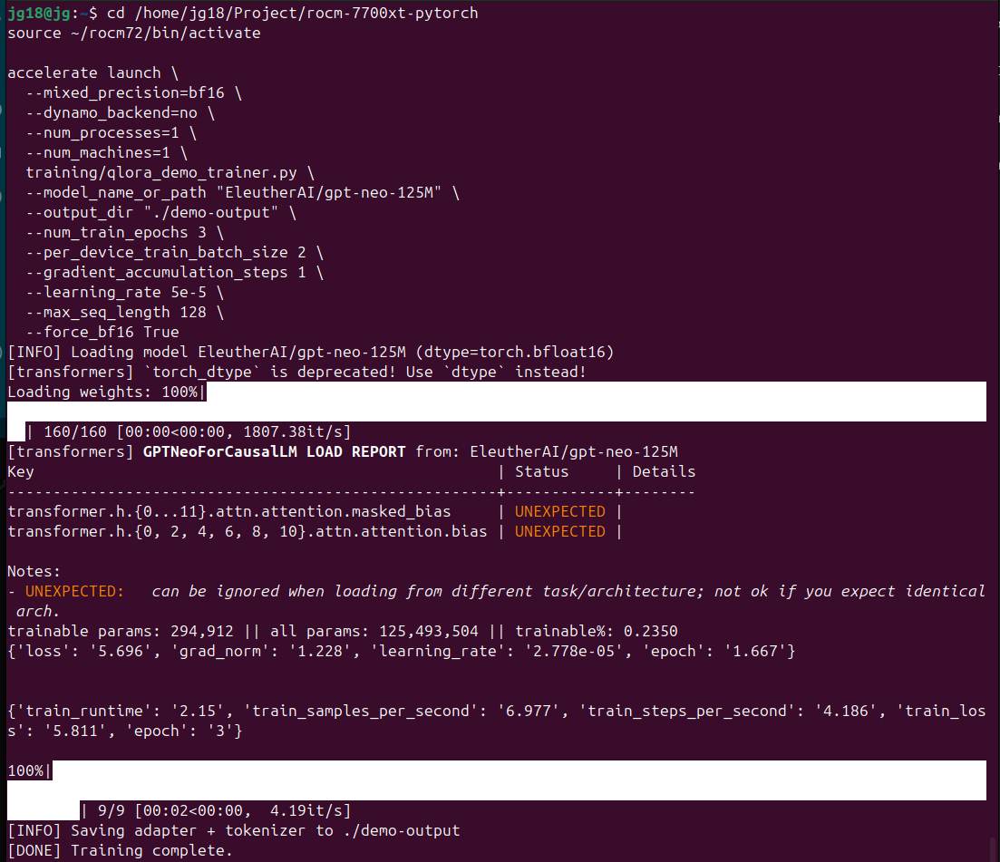
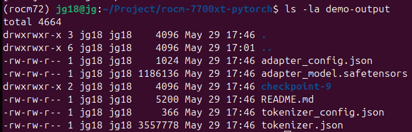
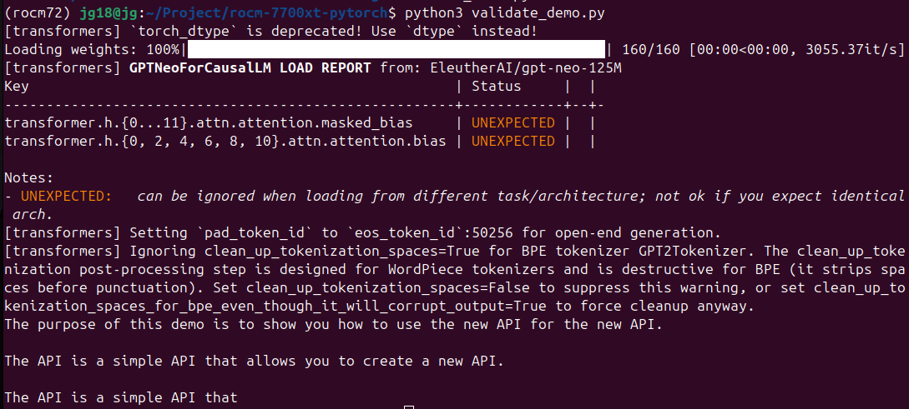

# ROCm QLoRA Demo — Fine‑Tuning on AMD RX 7700 XT

A small, reproducible demo for fine‑tuning a LoRA adapter on AMD ROCm using PyTorch.
This repository is designed for local ROCm workflows and avoids fragile cloud-dependent tooling.

Tested on a real **AMD RX 7700 XT (12GB VRAM)**.
Not included: blood, sweat, and tears 

---

## 🚀 Overview

This demo shows how to:

- fine-tune a small transformer model with **QLoRA** on ROCm
- save a working **LoRA adapter** and tokenizer
- load the adapter for inference with `validate_demo.py`

It is intentionally minimal and stable, with a focus on reproducibility for local AMD GPU users.

---

## 📁 Repository Structure

- `training/qlora_demo_trainer.py` — ROCm-compatible QLoRA training script
- `validate_demo.py` — load the saved adapter and generate a sample response
- `requirements.txt` — Python dependencies
- `demo-output/` — produced adapter and tokenizer files

---

## ⚙️ Prerequisites

- AMD GPU with ROCm support (tested on RX 7700 XT, 12GB VRAM)
- ROCm-enabled PyTorch build
- Python 3.10–3.12
- `accelerate`, `transformers`, `peft`

> If you use a different ROCm install path, update the activation command accordingly.

---

## 🧪 Quickstart

1. Activate your ROCm environment and switch to the repo:

```bash
source ~/rocm72/bin/activate
cd /home/jg18/Project/rocm-7700xt-pytorch
```

2. Run the training demo:

```bash
accelerate launch \
  --mixed_precision=bf16 \
  --dynamo_backend=no \
  --num_processes=1 \
  --num_machines=1 \
  training/qlora_demo_trainer.py \
  --model_name_or_path "EleutherAI/gpt-neo-125M" \
  --output_dir "./demo-output" \
  --num_train_epochs 3 \
  --per_device_train_batch_size 2 \
  --gradient_accumulation_steps 1 \
  --learning_rate 5e-5 \
  --max_seq_length 128 \
  --force_bf16 True
```

3. Verify the output files:

```bash
ls -la demo-output
```

Expected files:

- `adapter_model.safetensors`
- `adapter_config.json`
- `tokenizer.json`
- `tokenizer_config.json`

4. Validate the saved adapter:

```bash
python validate_demo.py
```

### Example `validate_demo.py`

```python
from transformers import AutoModelForCausalLM, AutoTokenizer
from peft import PeftModel
import torch

BASE = "EleutherAI/gpt-neo-125M"
ADAPTER = "./demo-output"

tokenizer = AutoTokenizer.from_pretrained(BASE)
model = AutoModelForCausalLM.from_pretrained(
    BASE,
    torch_dtype=torch.bfloat16,
    device_map="auto"
)

model = PeftModel.from_pretrained(model, ADAPTER)

prompt = "The purpose of this demo is"
inputs = tokenizer(prompt, return_tensors="pt").to(model.device)
out = model.generate(**inputs, max_new_tokens=40)

print(tokenizer.decode(out[0], skip_special_tokens=True))
```

This script loads the base model and the trained LoRA adapter, then prints a sample generated continuation.

---

## Screenshots

### Training Run (ROCm RX 7700 XT)


### Training Output


### Validation Output


## 💡 Notes

- Some `GPT-Neo` model loads may show `UNEXPECTED` key warnings for LoRA attention layers. This is expected and usually safe.
- Tokenizer cleanup warnings for GPT-Neo BPE are also harmless in this demo.
- The example training data is intentionally small, so the adapter can overfit quickly and demonstrate that the fine-tuning step worked.
- See `MODEL_CARD.md` for details about the demo adapter.
---

## 🧱 Hardware Requirements

- AMD RX 7700 XT (12GB VRAM)
- ROCm 6.x
- PyTorch ROCm build
- Python 3.10–3.12
- `accelerate`, `transformers`, `peft`

## 📌 Requirements

Install dependencies from `requirements.txt`:

```bash
pip install -r requirements.txt
```

---

## 🛠️ Troubleshooting

- If you see `UNEXPECTED` keys when loading GPT‑Neo: this is normal for LoRA‑patched attention layers.
- If you see tokenizer cleanup warnings: harmless for GPT‑Neo BPE.
- If `accelerate` complains about config: delete `~/.cache/huggingface/accelerate/default_config.yaml`.

---

## Git Attributes

This repo includes a `.gitattributes` file to prevent GitHub from diffing binary model files.

---

## 📝 License

This repository is released under the **MIT License**.


```
